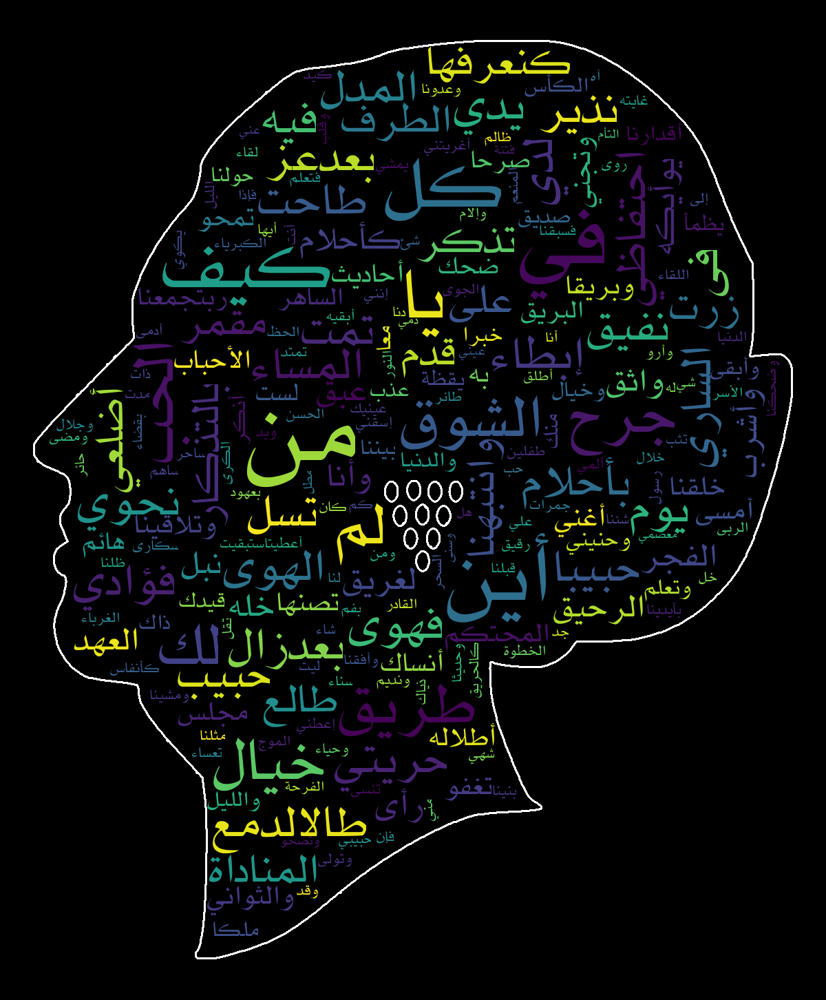

[](https://github.com/amueller/word_cloud/blob/master/LICENSE)


Arabic words cloud
================

This python simple script generates word cloud from arabic texts. Read more about word [word_cloud](https://github.com/amueller/word_cloud).
To avoid reverted text issue, I used [python-arabic-reshaper](https://github.com//mpcabd/python-arabic-reshaper)

## Required packages

Use pip to install :

* numpy
* pandas
* matplotlib
* pillow
* python-bidi
* wordcloud

## Tested fonts
Install the KacstOne fonts :
```
apt install fonts-kacst
```

## Usage examples

* A sample output for [One Thousand and One Nights](https://en.wikipedia.org/wiki/One_Thousand_and_One_Nights) "ألف ليلة وليلة" text (Part I):


* A sample output for [Hayy ibn Yaqdhan](https://en.wikipedia.org/wiki/Hayy_ibn_Yaqdhan) "حي بن يقضان" novel :


* A sample output for [Al-Atlal](https://en.wikipedia.org/wiki/Al-Atlal) "الأصلال" a famous classical poem singed by Oum Kalthoum :



* A sample output for [Geber](https://en.wikipedia.org/wiki/Jabir_ibn_Hayyan) Alchemical text :


## Known issues

* No support for texts with diacritical marks (i.e. العَربيةُ لُغةٌ رائِعةٌ).
* The common redundant words such as كان في ثم ... (prepositions, coordination etc.) must be cleaned manually.  
