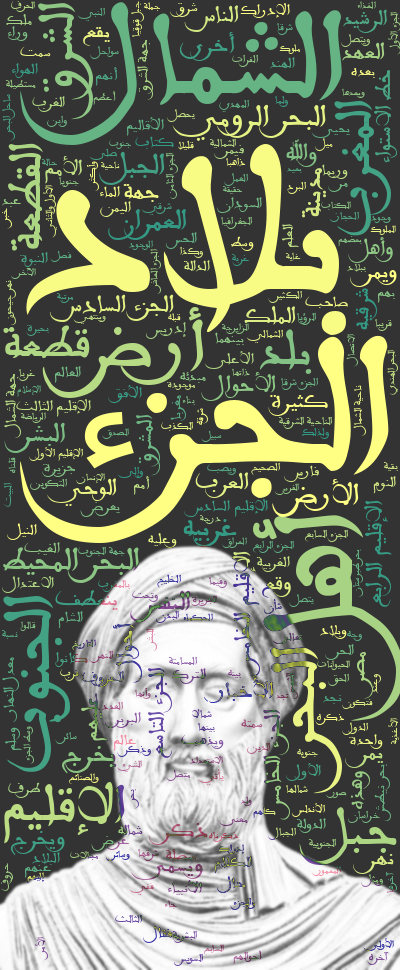

[](https://github.com/amueller/word_cloud/blob/master/LICENSE)

Arabic words cloud
================

This project provides a Python-based solution for generating word clouds from Arabic text using custom fonts, mask images, and an extensive set of options for customization and export formats. Read more about [word_cloud](https://github.com/amueller/word_cloud).


## Features

Generate word clouds from Arabic text.

Support for removing Arabic diacritics.

Customizable parameters for word cloud generation, including:

* Background color.

* Contour color.

* Colormap for colors.

* Overlay options for combining the word cloud with mask images using various blend modes (e.g., Difference, Add, Multiply).

* Export options for PNG, SVG, and PDF formats.

## Working Directory Structure

The input directory should contain the following subdirectories:

`fonts` : Contains font files (e.g., .ttf) used for rendering Arabic text.

`Masks`: Contains mask images (e.g., .png) used to shape the word clouds.

`Texts`: Contains input text files (e.g., .txt) for generating word clouds.

`Outputs`: Destination for the generated word clouds.

Additionally, a `stopwords.txt` file can be included in the input directory for filtering out common stopwords.

## Installation

Clone the repository or download the script.

Install the required Python libraries:
```
pip install wordcloud matplotlib pillow numpy
```


## Usage

### Initialization

Create an instance of the ArabicWordCloud class:

```Python
from your_script_name import ArabicWordCloud

wc = ArabicWordCloud(input_dir="path_to_input_directory")
```

### Generate the word cloud 

Use the generate_word_cloud method to generate and export word clouds:
```Python
wc.generate_word_cloud(
    text_file="example_text.txt",
    font_file="example_font.ttf",
    mask_file="example_mask.png",
    overlay_alpha=0.6,
    overlay_mode="Difference",
    blur_radius=1,
    mask_opacity=0.2,
    background_color="black",
    contour_color=None,
    color_palette="viridis",
    export_format="png"
)
```

### Parameters

`text_file`: Input text file located in the Texts directory.

`font_file`: Font file located in the Fonts directory.

`mask_file`: Mask image file located in the Masks directory.

`overlay_alpha`: Alpha value for overlaying the mask (default: 0.6).

`overlay_mode`: Blend mode for overlaying the mask on the word cloud (None by default; options include Difference, Add, Multiply, etc.).

`blur_radius`: Radius for Gaussian blur applied to the mask (default: 1).

`mask_opacity`: Opacity for the mask overlay (default: 0.2).

`background_color`: Background color of the word cloud (default: "black").

`contour_color`: Contour color of the word cloud (default: None).

`color_palette`: Colormap for word cloud colors (default: "viridis").

`export_format`: File format for export ("png", "svg", "pdf"; default: "png").


## Usage examples
* Ibn Khaldun's [Muqaddimah](https://en.wikipedia.org/wiki/Muqaddimah) "المقدمة" (first part):



* Avicenna's [The Canon of Medicine](https://en.wikipedia.org/wiki/The_Canon_of_Medicine) "القانون في الطب" (extract):


* [One Thousand and One Nights](https://en.wikipedia.org/wiki/One_Thousand_and_One_Nights) "ألف ليلة وليلة" (Part I):


* Ibn Tufail's [Hayy ibn Yaqdhan](https://en.wikipedia.org/wiki/Hayy_ibn_Yaqdhan) "حي بن يقضان" novel :


* [Ahmed Shawqi](https://en.wikipedia.org/wiki/Ahmed_Shawqi) "أحمد شوقي" poems extracts  :


* [Mahmoud Darwish](https://en.wikipedia.org/wiki/Mahmoud_Darwish) "مَحمُود دَرْوِيْش" poems extracts  :


* [Imru'_al-Qays](https://en.wikipedia.org/wiki/Imru%27_al-Qais) "امرأ القيس" poems extracts  :


* [Al-Atlal](https://en.wikipedia.org/wiki/Al-Atlal) "الأطلال" a famous classical poem singed by Oum Kalthoum :


* [Geber](https://en.wikipedia.org/wiki/Jabir_ibn_Hayyan) Alchemical text :


## Acknowledgment 

* Thanks to [Waad Alshammari](https://github.com/Waadtss)  for the [Stop words list](https://github.com/Waadtss/AraMed-arabic-stop-words).


